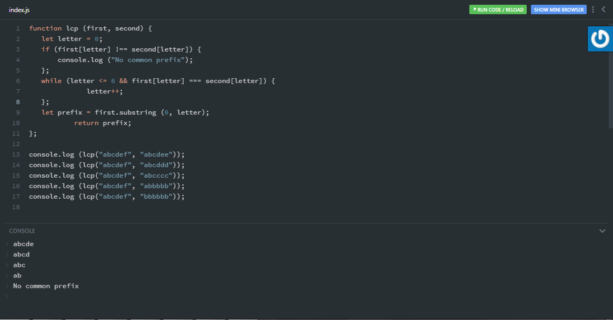
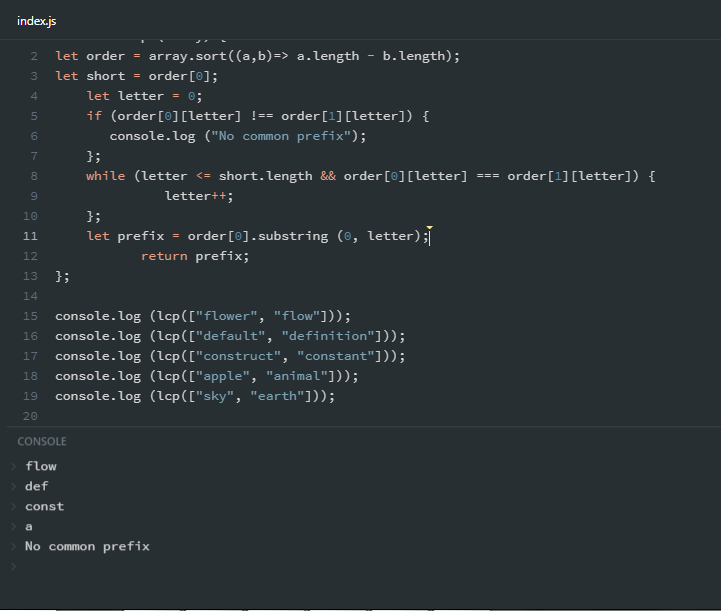

# longestcommonprefix

The script takes two words (each of 6 letter length) and returns the longest common prefix of these two words.

The script takes two words of any length and returns the longest common prefix of these two words.

